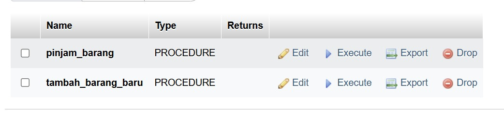

# 📦 InvesBar – Sistem Informasi Inventaris Barang

**InvesBar** adalah aplikasi web yang digunakan untuk mencatat dan mengelola inventaris barang serta proses peminjaman dan pengembalian di lingkungan organisasi. Sistem ini dikembangkan menggunakan **PHP Native** dan **MySQL**, serta dilengkapi fitur manajemen pengguna, peminjaman barang, dan backup otomatis. Selain itu, sistem ini mengimplementasikan **stored procedure**, **trigger**, **transaction**, dan **stored function** untuk menjaga integritas dan efisiensi data.


---

## ✨ Fitur Utama

* 👥 Manajemen pengguna (admin & staf)
* 📦 Manajemen data barang (CRUD)
* 🗑️ Peminjaman dan pengembalian barang
* 🔄 Pemrosesan otomatis melalui trigger dan procedure
* 📂 Backup database otomatis via script
* 🔐 Login aman dengan bcrypt

---

## 🗃 Struktur Tabel

* **users**: Menyimpan data pengguna dan role (admin/staf)
* **barang**: Menyimpan data inventaris barang
* **peminjaman**: Menyimpan data transaksi peminjaman dan pengembalian

---

## ⚙ Stored Procedure

### 📌 1. `pinjam_barang`

Menambahkan peminjaman baru dan otomatis mengurangi stok barang.

```sql
DELIMITER //
CREATE PROCEDURE pinjam_barang (
    IN p_id_user INT,
    IN p_id_barang INT,
    IN p_jumlah INT,
    IN p_tanggal DATE
)
BEGIN
    DECLARE stok_tersedia INT;

    SELECT stok INTO stok_tersedia FROM barang WHERE id = p_id_barang;

    IF stok_tersedia >= p_jumlah THEN
        INSERT INTO peminjaman (id_user, id_barang, jumlah, tanggal_pinjam, status)
        VALUES (p_id_user, p_id_barang, p_jumlah, p_tanggal, 'dipinjam');

        UPDATE barang SET stok = stok - p_jumlah WHERE id = p_id_barang;
    ELSE
        SIGNAL SQLSTATE '45000' SET MESSAGE_TEXT = 'Stok tidak mencukupi.';
    END IF;
END //
DELIMITER ;
```

**Lokasi File PHP:** `staf/pinjam.php`
**Screenshot:** 

---

### 📌 2. `tambah_barang_baru`

Menambahkan data barang baru ke tabel `barang`.

```php
<?php
require '../includes/db.php';

$nama_barang = $_POST['nama_barang'];
$deskripsi = $_POST['deskripsi'];
$stok = $_POST['stok'];

$stmt = $conn->prepare("CALL tambah_barang_baru(?, ?, ?)");
$stmt->bind_param("ssi", $nama_barang, $deskripsi, $stok);

if ($stmt->execute()) {
    echo "✅ Barang berhasil ditambahkan!";
} else {
    echo "❌ Gagal menambahkan barang: " . $conn->error;
}
$stmt->close();
?>
```

---

## 🔄 Trigger

Trigger `kembalikan_barang` akan menambah stok jika status peminjaman diubah menjadi *dikembalikan*.

```sql
DELIMITER //
CREATE TRIGGER kembalikan_barang
AFTER UPDATE ON peminjaman
FOR EACH ROW
BEGIN
    IF OLD.status = 'dipinjam' AND NEW.status = 'dikembalikan' THEN
        UPDATE barang
        SET stok = stok + OLD.jumlah
        WHERE id = OLD.id_barang;
    END IF;
END //
DELIMITER ;
```

📸 Screenshot: `assets/img/trigger-kembalikan.png`

---

## 🔁 Transaction (PHP)

Menjamin data tetap konsisten saat proses peminjaman dilakukan:

```php
<?php
require '../config/koneksi.php';

$conn->begin_transaction();

try {
    mysqli_query($conn, $query_insert);
    mysqli_query($conn, $query_update_stok);
    mysqli_commit($conn);
} catch (Exception $e) {
    mysqli_rollback($conn);
    echo "Gagal melakukan peminjaman.";
}
```

📸 Screenshot: `assets/img/transaction-php.png`

---

## 🧠 Stored Function

### `total_barang_dipinjam`

Mengembalikan jumlah total barang yang sedang dipinjam oleh user.

```sql
DELIMITER //
CREATE FUNCTION total_barang_dipinjam(p_user_id INT)
RETURNS INT
DETERMINISTIC
BEGIN
    DECLARE total INT;
    SELECT SUM(jumlah) INTO total
    FROM peminjaman
    WHERE id_user = p_user_id AND status = 'dipinjam';
    RETURN IFNULL(total, 0);
END //
DELIMITER ;
```

**Contoh Penggunaan di PHP:**

```php
$totalPinjam = $peminjamanModel->totalPeminjamanUser($userId);
```

**Tampilan HTML:**

```html
<div class="text-center mt-3">
    <h5>Total Peminjaman</h5>
    <p class="fw-bold fs-4"><?= $totalPinjam ?> barang</p>
</div>
```

📸 Screenshot: `assets/img/function-total-pinjaman.png`

---

## 🗂 Backup Otomatis

Script untuk backup database secara otomatis:

```bash
#!/bin/bash

DB_NAME="invesbar_db"
DB_USER="root"
DB_PASS="YourPassword"
BACKUP_DIR="/home/username/backup/invesbar"
TIMESTAMP=$(date +"%F-%H%M")
BACKUP_FILE="$BACKUP_DIR/invesbar_${TIMESTAMP}.sql"

mysqldump -u $DB_USER -p$DB_PASS $DB_NAME > $BACKUP_FILE

echo "Backup selesai: $BACKUP_FILE"
```

📸 Screenshot: `assets/img/backup-script.png`

---

## 🖼 Tampilan Aplikasi

* **Dashboard**
  

* **Form Peminjaman**
  

* **Riwayat Pengembalian**
  

---

## 💻 Teknologi yang Digunakan

* PHP Native
* MySQL
* HTML, CSS (Bootstrap)
* JavaScript
* phpMyAdmin

---

## 🚀 Cara Menjalankan Proyek

1. **Clone repositori:**

```bash
git clone https://github.com/kartikaaadn/InvesBar.git
```

2. **Import database:**

   * Buka phpMyAdmin
   * Import file `invesbar_db.sql`

3. **Edit koneksi database:**

```php
$conn = new mysqli("localhost", "root", "", "invesbar_db");
```

4. **Akses aplikasi:**

   Buka di browser `http://localhost/InvesBar/`

---

## 👩‍💻 Developer

* kartikaadn
* dwiandini01
* chelseayetri

---


