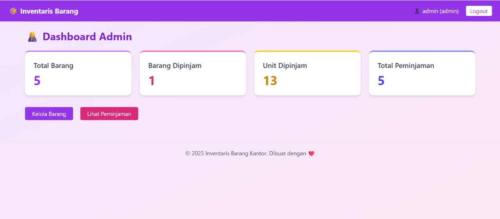
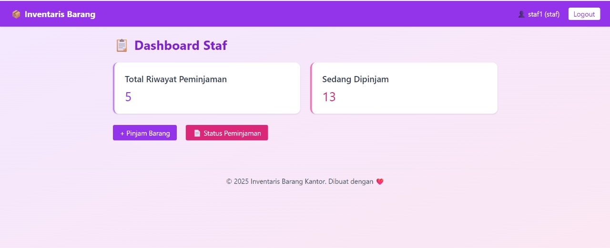
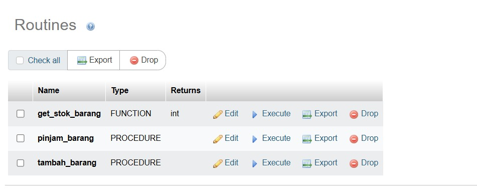
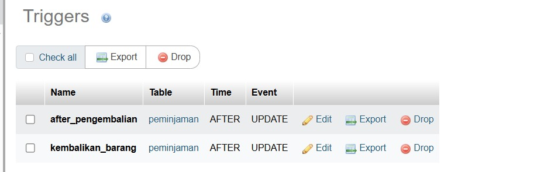

`markdown
# 📦 InvesBar – Sistem Informasi Inventaris Barang

**InvesBar** adalah aplikasi web yang digunakan untuk mencatat dan mengelola inventaris barang serta proses peminjaman dan pengembalian di lingkungan organisasi. Sistem ini dikembangkan menggunakan **PHP Native** dan **MySQL**, serta dilengkapi fitur manajemen pengguna, peminjaman barang, dan backup otomatis. Selain itu, sistem ini mengimplementasikan **stored procedure**, **trigger**, **transaction**, dan **stored function** untuk menjaga integritas dan efisiensi data.

---

## ✨ Fitur Utama

- 👥 Manajemen pengguna (admin & staf)
- 📦 Manajemen data barang (CRUD)
- 📝 Peminjaman dan pengembalian barang
- 🔄 Pemrosesan otomatis melalui trigger dan procedure
- 💾 Backup database otomatis via script
- 🔐 Login aman dengan bcrypt

---

## 🗃 Struktur Tabel

- **users**: Menyimpan data pengguna dan role (admin/staf)
- **barang**: Menyimpan data inventaris barang
- **peminjaman**: Menyimpan data transaksi peminjaman dan pengembalian barang

---

## ⚙ Stored Procedure

Procedure `pinjam_barang` digunakan untuk mencatat transaksi peminjaman dan otomatis mengurangi stok barang jika stok mencukupi.

## Code 
sql
Copy
Edit
DELIMITER //

CREATE PROCEDURE PinjamBarang(
    IN p_id_user INT,
    IN p_id_barang INT,
    IN p_jumlah INT
)
BEGIN
    DECLARE current_stok INT;

    SELECT stok INTO current_stok FROM barang WHERE id = p_id_barang;

    IF current_stok >= p_jumlah THEN
        START TRANSACTION;

        UPDATE barang 
        SET stok = stok - p_jumlah
        WHERE id = p_id_barang;

        INSERT INTO peminjaman (id_user, id_barang, jumlah, tanggal_pinjam, status)
        VALUES (p_id_user, p_id_barang, p_jumlah, CURDATE(), 'dipinjam');

        COMMIT;
    ELSE
        SIGNAL SQLSTATE '45000'
        SET MESSAGE_TEXT = 'Stok tidak mencukupi!';
    END IF;
END //
DELIMITER ;

🔧 Contoh pemanggilan:

sql
Copy
Edit
CALL PinjamBarang(2, 1, 2);

   
`
📌 1. pinjam_barang
Stored procedure ini digunakan untuk menambahkan peminjaman baru dan otomatis mengurangi stok barang yang dipinjam.

Lokasi File:
staf/pinjam.php

Penjelasan Fungsi:
pinjam_barang(p_id_user, p_id_barang, p_jumlah, p_tanggal_pinjam)
Digunakan saat staf melakukan peminjaman barang. Procedure akan menyimpan data peminjaman ke tabel peminjaman dan mengurangi stok barang.

Contoh Pemanggilan di PHP:
php
Copy
Edit
<?php
require '../includes/db.php'; // koneksi ke database

$id_user = $_SESSION['user_id'];
$id_barang = $_POST['id_barang'];
$jumlah = $_POST['jumlah'];
$tanggal_pinjam = date('Y-m-d');

// Call the pinjam_barang stored procedure
$stmt = $conn->prepare("CALL pinjam_barang(?, ?, ?, ?)");
$stmt->bind_param("iiis", $id_user, $id_barang, $jumlah, $tanggal_pinjam);

if ($stmt->execute()) {
    echo "✅ Peminjaman berhasil dicatat!";
} else {
    echo "❌ Gagal meminjam: " . $conn->error;
}
$stmt->close();
?>
📌 2. tambah_barang_baru
Stored procedure ini digunakan untuk menambahkan data barang baru ke tabel barang.

Lokasi File:
admin/tambah-barang.php

Penjelasan Fungsi:
tambah_barang_baru(p_nama_barang, p_deskripsi, p_stok)
Memasukkan barang baru ke dalam tabel barang saat admin menambahkan item ke inventaris.

Contoh Pemanggilan di PHP:
php
Copy
Edit
<?php
require '../includes/db.php'; // koneksi ke database

$nama_barang = $_POST['nama_barang'];
$deskripsi = $_POST['deskripsi'];
$stok = $_POST['stok'];

// Call the tambah_barang_baru stored procedure
$stmt = $conn->prepare("CALL tambah_barang_baru(?, ?, ?)");
$stmt->bind_param("ssi", $nama_barang, $deskripsi, $stok);

if ($stmt->execute()) {
    echo "✅ Barang berhasil ditambahkan!";
} else {
    echo "❌ Gagal menambahkan barang: " . $conn->error;
}
$stmt->close();
?>

✅ 1. Coba Stored Procedure (tambah_barang)
sql

CALL tambah_barang('BR006', 'Laptop', 'Lenovo ThinkPad', 'gudang', 'baik', 5);
Lalu cek:

sql
Copy
Edit
SELECT * FROM barang WHERE kode_barang = 'BR006';

---

## 🔄 Trigger

Secara otomatis menambah stok kembali saat barang dikembalikan (status berubah menjadi 'dikembalikan'):

## Code 
sql
Copy
Edit
DELIMITER //

CREATE TRIGGER kembalikan_stok
AFTER UPDATE ON peminjaman
FOR EACH ROW
BEGIN
    IF OLD.status = 'dipinjam' AND NEW.status = 'dikembalikan' THEN
        UPDATE barang
        SET stok = stok + NEW.jumlah
        WHERE id = NEW.id_barang;
    END IF;
END //

DELIMITER ;

penjelasan tentang triggernya

Trigger kurangi_stok_setelah_transaksi secara otomatis aktif setiap kali sistem melakukan proses pencatatan transaksi baru di tabel transaksi:

✅ Contoh pemicu aktivasi trigger:
sql
Copy
Edit
INSERT INTO transaksi (id_barang, jumlah, tanggal_transaksi, keterangan)
VALUES (3, 2, CURDATE(), 'Peminjaman proyektor untuk rapat mingguan');

🔄 Beberapa peran trigger ini dalam sistem:
Otomatis mengurangi stok barang
Saat transaksi dicatat (misalnya barang digunakan/peminjaman), trigger langsung mengurangi nilai stok di tabel barang berdasarkan id_barang dan jumlah yang tercatat.

Menjamin konsistensi antara transaksi dan stok barang
Meskipun sistem frontend atau aplikasi lupa memperbarui stok, trigger ini akan memastikan perubahan tetap dilakukan secara otomatis dan sinkron.

Mencegah manipulasi stok secara manual dari luar prosedur resmi
Dengan trigger ini, tidak ada celah untuk menambahkan transaksi namun lupa atau sengaja tidak mengubah stok barang.

Mengurangi beban logika validasi di aplikasi (PHP)
Karena logika pengurangan stok terjadi langsung di database, aplikasi tidak perlu menangani proses ini secara eksplisit, meningkatkan reliabilitas sistem.

✅ 3. Coba Trigger (after_pengembalian)
Update status dari dipinjam ke dikembalikan di tabel peminjaman:

sql
Copy
Edit
UPDATE peminjaman 
SET status = 'dikembalikan', tanggal_kembali = CURDATE() 
WHERE id = 3;

sql
Copy
Edit
SELECT stok FROM barang WHERE id = 5;

---

## 🔁 Transaction (PHP)

Untuk menjamin konsistensi data saat melakukan peminjaman barang, digunakan konsep transaksi dalam PHP.

## Code 
sql
Copy
Edit
-- Transaksi untuk meminjam barang
START TRANSACTION;

-- Cek stok terlebih dahulu (logika ini biasanya ditangani di aplikasi PHP juga)
UPDATE barang
SET stok = stok - 2
WHERE id = 1 AND stok >= 2;

-- Masukkan data peminjaman jika stok cukup
INSERT INTO peminjaman (id_user, id_barang, jumlah, tanggal_pinjam, status)
VALUES (2, 1, 2, CURDATE(), 'dipinjam');

-- Commit transaksi jika semua berhasil
COMMIT;

✅ 4. Coba Transaction Manual (uji rollback)
sql
Copy
Edit
START TRANSACTION;
UPDATE barang SET stok = stok - 2 WHERE id = 5;

INSERT INTO peminjaman (id_user, id_barang, jumlah, tanggal_pinjam, status) 
VALUES (2, 3, 3, CURDATE(), 'dipinjam');

-- Jika tidak ada error:
COMMIT;

-- Jika ada error:
-- ROLLBACK;
Cek kembali:

sql
Copy
Edit
SELECT * FROM barang WHERE id = 5;
SELECT * FROM peminjaman WHERE id_barang = 5 ORDER BY id DESC LIMIT 1;

---

## 🧠 Stored Function
FUNCTION
Menghitung total pinjaman user:

## Code 
sql
Copy
Edit
DELIMITER //

CREATE FUNCTION TotalPinjamanUser(uid INT)
RETURNS INT
DETERMINISTIC
BEGIN
    DECLARE total INT;
    SELECT COUNT(*) INTO total FROM peminjaman WHERE id_user = uid;
    RETURN total;
END //

DELIMITER ;
🔧 Contoh penggunaan:

sql
Copy
Edit
SELECT TotalPinjamanUser(2) AS total_peminjaman;

DELIMITER ;

ini penjelasan untuk function

📄 Lokasi Tampilan: dashboard_user.php
php
Copy
Edit
$totalPinjam = $peminjamanModel->totalPeminjamanUser($userId);
html
Copy
Edit

    <h5>Total Peminjaman</h5>
    
<?= $totalPinjam ?> barang

💼 Validasi Stok di Procedure pinjam_barang
sql
Copy
Edit
SET v_stok = get_stok_barang(p_id_barang);

IF v_stok < p_jumlah THEN
    SIGNAL SQLSTATE '45000'
    SET MESSAGE_TEXT = 'Stok barang tidak mencukupi',
        MYSQL_ERRNO = 1647;
END IF;

✅ 2. Coba Function (get_stok_barang)
sql
Copy
Edit

SELECT get_stok_barang(3) AS stok_laptop_asus;

---

## 🗂 Backup Otomatis

Sistem ini menyediakan script shell untuk melakukan backup database otomatis, cocok dijalankan via **crontab** di server Linux/WSL.

bash
#!/bin/bash

DB_NAME="invesbar_db"
DB_USER="root"
DB_PASS="YourPassword"
BACKUP_DIR="/home/username/backup/invesbar"
TIMESTAMP=$(date +"%F-%H%M")
BACKUP_FILE="$BACKUP_DIR/invesbar_${TIMESTAMP}.sql"

mkdir -p "$BACKUP_DIR"
mysqldump -u $DB_USER -p$DB_PASS $DB_NAME > "$BACKUP_FILE"

if [ $? -eq 0 ]; then
    echo "✅ Backup selesai: $BACKUP_FILE"
else
    echo "❌ Backup gagal!"
fi

📅 **Jadwal via crontab:**

bash
0 2 * * * /bin/bash /home/username/scripts/backup_invesbar.sh

📸 **Disarankan Screenshot:** `assets/img/backup-script.png`

---

## 🖼 Tampilan Aplikasi
* **Login**
  

* **Dashboard**
  

* **Staf**
  
  
* **Database**
  

   
  

---

## 💻 Teknologi yang Digunakan

* PHP Native
* MySQL
* HTML, CSS (Bootstrap)
* JavaScript (sedikit interaksi)
* phpMyAdmin (untuk manajemen DB)

---

## 🚀 Cara Menjalankan Proyek

1. **Clone repositori:**

   bash
   git clone https://github.com/kartikaaadn/InvesBar.git
   

2. **Import database:**

   * Buka `phpMyAdmin` → Import file `invesbar_db.sql`.

3. **Edit koneksi database di `config/koneksi.php`:**

   php
   $conn = new mysqli("localhost", "root", "", "invesbar_db");
   

4. **Jalankan di browser:**

   * Buka `http://localhost/InvesBar/`

---

## 👩‍💻 Developer

* kartikaaadn
* dwiandini01
* Chelseayetri
